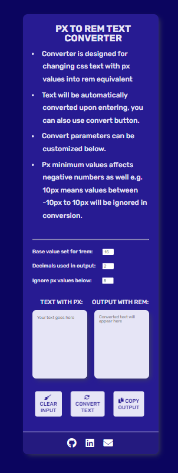
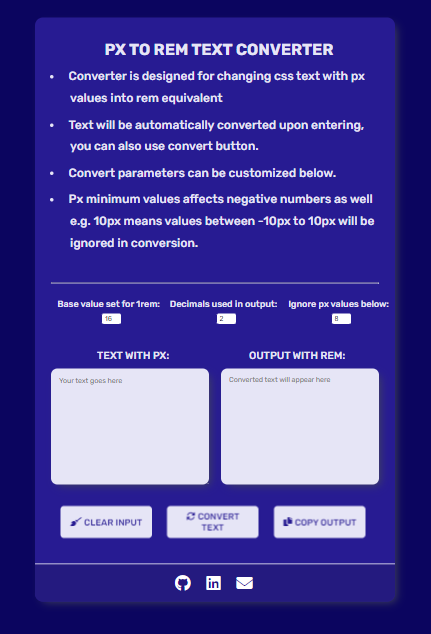

# PX TO REM TEXT CONVERTER

This web app let's users convert px values to their rem equivalent. Paste your text in input box and click convert. There are also buttons for clearing inpu and copying converted text. 

This app was made to help incorporate ready designs (e.g. Figma) or change  old code faster. 

## Table of contents

- [Overview](#overview)
  - [Screenshot](#screenshot)
  - [Links](#links)
- [My process](#my-process)
  - [Built with](#built-with)
  - [Resources](#resources)
  - [Status](#status)
- [Author](#author)

## Overview

### Screenshot

XS 375px:  
  

MD 768px:  
  

XL 1200px:
  

### Links

- GitHub Repository: [https://github.com/dominikapap/px-to-rem-converter](https://github.com/dominikapap/px-to-rem-converter)
- Live Site URL: [https://px-to-rem-text-converter.netlify.app/](https://px-to-rem-text-converter.netlify.app/)

## My process

### Built with

- Semantic HTML5 markup
- SASS/SCSS,CSS custom properties
- Flexbox
- Grid
- Mobile-first workflow
- RWD
- JavaScript ES2015

### Resources
- Hover effects on icons within buttons made using [Hover.css](https://ianlunn.github.io/Hover/)
- Favicon made using [Free Logo Design](https://www.freelogodesign.org/)

### Status
  Almost finished, things left to do:
  - split script.js into modules
  - make sure app works well on different kind of devices

## Author

- Linkedin - [My LinkedIn profile](https://www.linkedin.com/in/dominika-papierska-1ba09311a/)
- Email - domi.papierska@gmail.com

